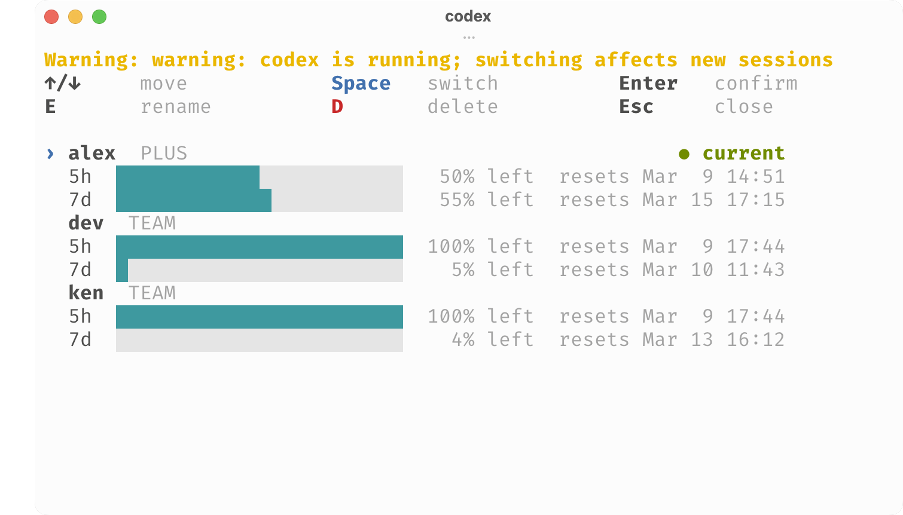

# codex-auth

`codex-auth` is a standalone terminal UI for managing multiple local Codex auth profiles in `~/.codex`.

It is built as a single Go binary, installs cleanly with Homebrew, auto-saves the active account if needed, and uses your terminal theme instead of shipping a hardcoded color theme.



## What It Handles

- discovers managed accounts from `~/.codex/accounts/*.json`
- reads the active account from `~/.codex/auth.json`
- auto-saves the active account if it is not already managed
- switches accounts from one interactive screen
- renames accounts inline
- deletes managed accounts inline
- shows quota immediately and refreshes live usage in the background

## Install

### Homebrew

Preferred install path:

```bash
brew install Alexs7zzh/tap/codex-auth
```

Or:

```bash
brew tap Alexs7zzh/tap
brew install codex-auth
```

### GitHub Release Download

Download a release tarball from the [GitHub Releases page](https://github.com/Alexs7zzh/codex-auth/releases), unpack it, and move `codex-auth` onto your `PATH`.

Example:

```bash
tar -xzf codex-auth_v0.3.0_darwin_arm64.tar.gz
mv codex-auth_v0.3.0_darwin_arm64/codex-auth ~/.local/bin/codex-auth
```

### Build From Source

```bash
go build -o codex-auth ./cmd/codex-auth
```

## Usage

Run:

```bash
codex-auth
```

The picker opens directly and shows:

- each managed account
- the current active account
- quota remaining and reset times

If your current `auth.json` is not already managed, `codex-auth` saves it automatically and includes it in the list.

## Controls

- `Up/Down` or `j/k`: move
- `Space`: switch
- `Enter`: confirm switch, rename, delete, or exit
- `e`: rename
- `d`: delete selected managed account
- `Esc` or `q`: close

## Notes

- `codex-auth` uses your terminal's ANSI theme for most of its styling.
- If the official `codex` CLI is already running, switching accounts only affects new sessions.
- The quota view prefers live data, but still shows the last known state immediately while refreshing.
